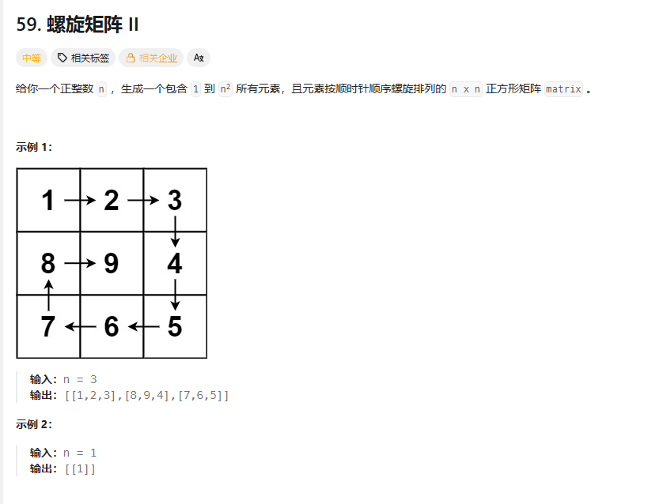
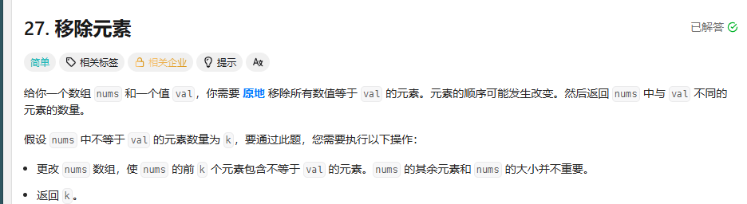
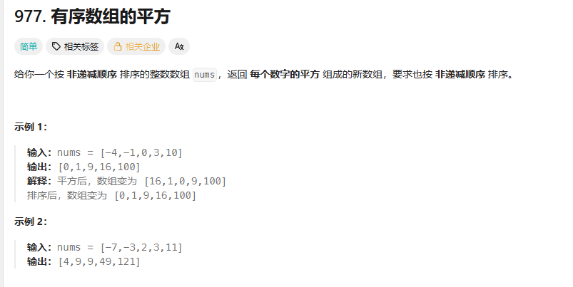
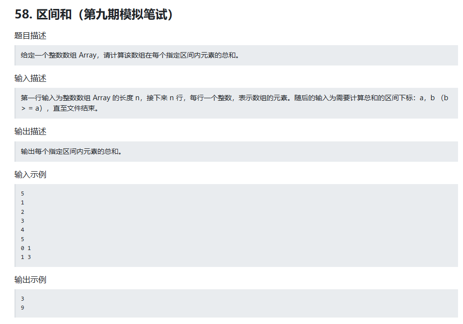
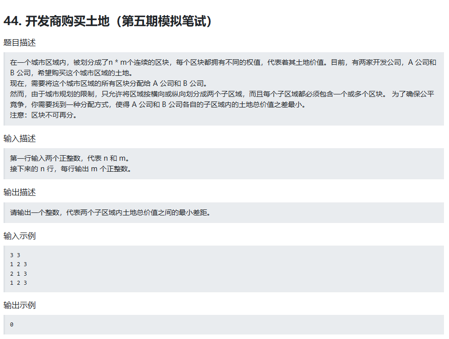
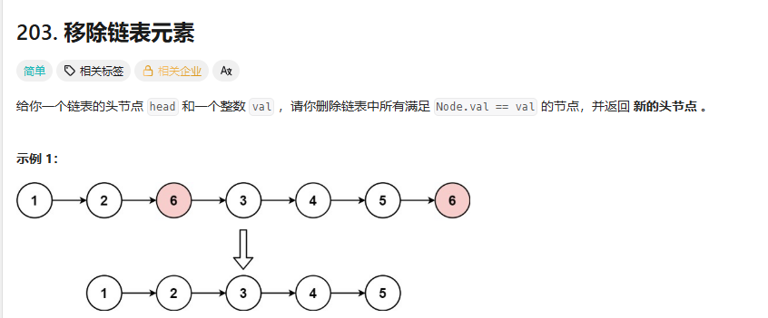

# 螺旋矩阵问题

关键在于循环不变量原则，保证左闭右开
```
class Solution {
public:
    vector<vector<int>> generateMatrix(int n) {
        vector<vector<int>>matrix(n,vector<int>(n));
        int count=1;
        int loop=n/2;
        int mid=n/2;//用于奇数时处理中间
        int steps=n-1;//处理每轮一条边走几步
        int start_x=0,start_y=0;
        while(loop--){
            for(int i=0;i<steps;i++){
                matrix[start_x][start_y+i]=count++;
            }
            for(int i=0;i<steps;i++){
                matrix[start_x+i][start_y+steps]=count++;
            }
            for(int i=0;i<steps;i++){
                matrix[start_x+steps][start_y+steps-i]=count++;
            }
            for(int i=0;i<steps;i++){
                matrix[start_x+steps-i][start_y]=count++;
            }
            start_x++;
            start_y++;
            steps-=2;
        }
        if(n%2==1){
            matrix[mid][mid]=n*n;
        }

        return matrix;
    }
};
```
# 移除元素

快慢指针来做O(n)
慢指针维护结果数组，快指针遍历所有元素
```
class Solution {
public:
    int removeElement(vector<int>& nums, int val) {
        int slowindex,fastindex;
        slowindex=0,fastindex=0;
        int k=0;
        while(fastindex!=nums.size()){
            if(nums[fastindex]!=val){
                nums[slowindex]=nums[fastindex];
                slowindex++;
                fastindex++;
                k++;
            }
            else
            fastindex++;
        }
        return k;
    }
};
```
# 有序数组的平方

依旧双指针，两头比较
```
class Solution {
public:
    vector<int> sortedSquares(vector<int>& nums) {
        int a,b;//双指针
        a=0,b=nums.size()-1;
        vector<int>res;
        while(a<=b){
            if(nums[a]*nums[a]>=nums[b]*nums[b]){
                res.insert(res.begin(),nums[a]*nums[a]);
                a++;
            }
            else{
                res.insert(res.begin(),nums[b]*nums[b]);
                b--; 
            }
        }
        return res;
    }
};
```
# 区间和

前缀和思想
测试用例大的时候cin超时，考虑scanf
```
#include<bits/stdc++.h>
using namespace std;
int main(){
    int n;
    cin>>n;
    int sum=0,num;
    vector<int>prefix_sum(n);
    for(int i=0;i<n;i++){
        //cin>>num;
        scanf("%d",&num);
        sum+=num;
        prefix_sum[i]=sum;
    }
    int a,b;
    while(scanf("%d%d",&a,&b)==2){
        if(a>=1)
        cout<<prefix_sum[b]-prefix_sum[a-1]<<endl;
        else
        cout<<prefix_sum[b]<<endl;
    }
    return 0;
}//用cin就超时，scanf就不超时
```
# 开发商购买土地

求行和数组，前缀和，再求列和数组，前缀和解即可；
降维思想。
```
#include<bits/stdc++.h>
using namespace std;
int main(){
    int n,m;
    cin>>n>>m;
    vector<vector<int>>matrix(n,vector<int>(m));
    for(int i=0;i<n;i++){
        for(int j=0;j<m;j++){
            cin>>matrix[i][j];
        }
    }
    //横向划分
    int n1=INT_MAX;//n1记录与总和一半的最小差
    vector<int>row(n);
    for(int i=0;i<n;i++)
        for(int j=0;j<m;j++){
        row[i]+=matrix[i][j];
    }
    vector<int>prefix_row(n);
    int sum=0;
    for(int i=0;i<n;i++){
        sum+=row[i];
        prefix_row[i]=sum;
    }
    for(int i=0;i<n;i++){
        n1=min(abs(prefix_row[n-1]-2*prefix_row[i]),n1);
    }
    //纵向划分
    int n2=INT_MAX;//n2记录与总和一半的最小差
    vector<int>column(m);
    for(int i=0;i<m;i++)
        for(int j=0;j<n;j++){
        column[i]+=matrix[j][i];
    }
    vector<int>prefix_col(m);
    sum=0;
    for(int i=0;i<m;i++){
        sum+=column[i];
        prefix_col[i]=sum;
    }
    for(int i=0;i<m;i++){
        n2=min(abs(prefix_col[m-1]-2*prefix_col[i]),n2);
    }
    int res=min(n1,n2);
    cout<<res;
    return 0;

}
```
# 移除链表元素_递归写法

搞清递归函数的作用 比如我定义：函数要完成"输入当前节点，并返回处理好的当前节点"的功能，并递归处理后面节点
```
/**
 * Definition for singly-linked list.
 * struct ListNode {
 *     int val;
 *     ListNode *next;
 *     ListNode() : val(0), next(nullptr) {}
 *     ListNode(int x) : val(x), next(nullptr) {}
 *     ListNode(int x, ListNode *next) : val(x), next(next) {}
 * };
 */
class Solution {
public:
//搞清递归函数的作用 比如我定义：函数要完成输入当前节点，并返回处理好的当前节点，递归处理后面节点
    ListNode* recursion(ListNode*now,int val){
        if(now==NULL)
        return NULL;
        if(now->val==val){
            ListNode*res=recursion(now->next,val);
            delete now;
            return res;
        }
        else{
            now->next=recursion(now->next,val);
            return now;
        }
    }
    ListNode* removeElements(ListNode* head, int val) {
        ListNode*res;
        res=recursion(head,val);
        return res;
    }
};
```